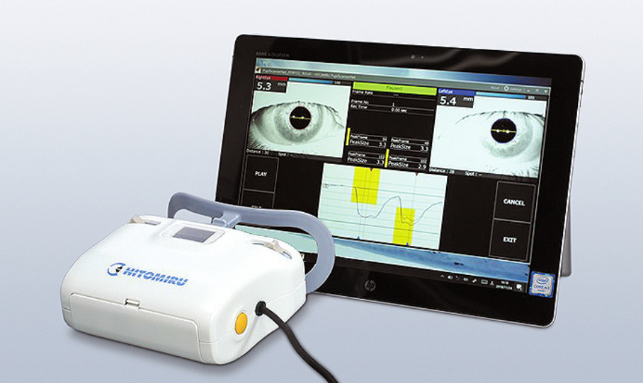
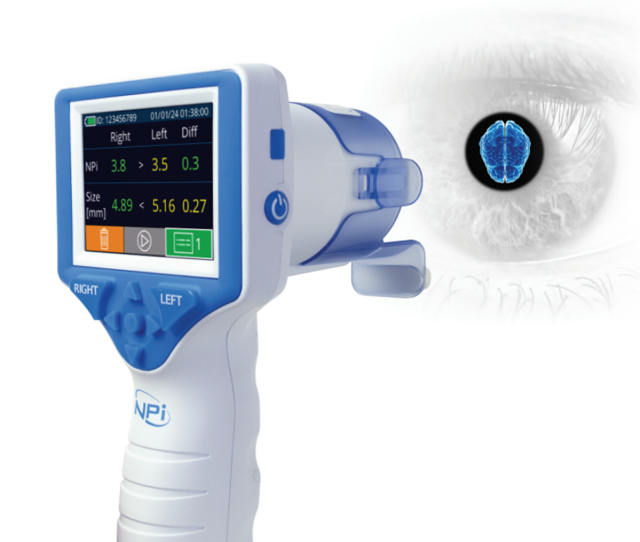
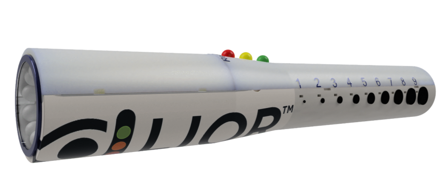
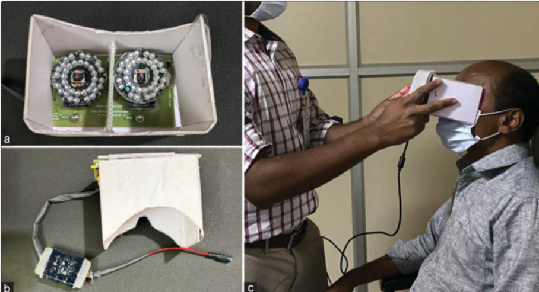
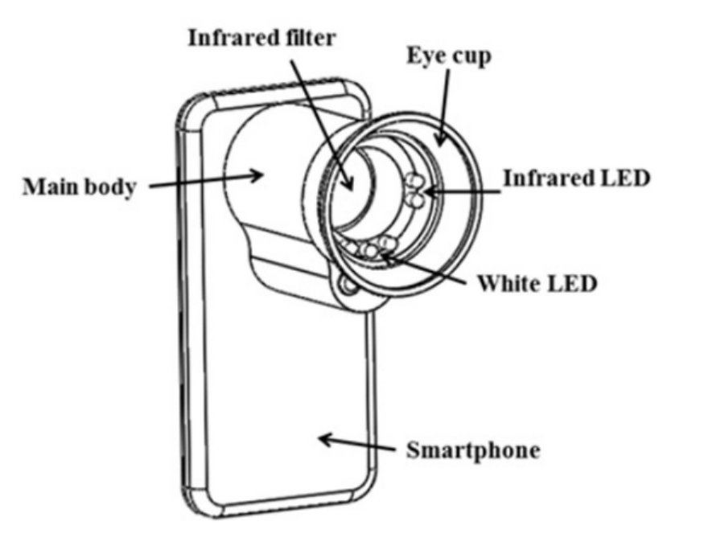
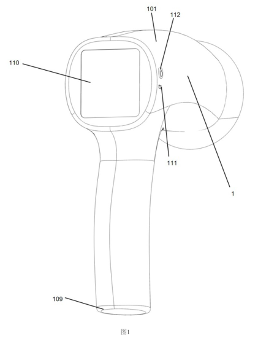
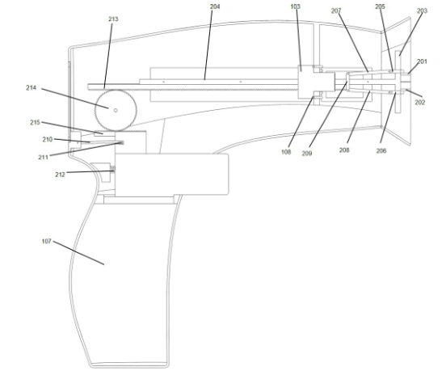
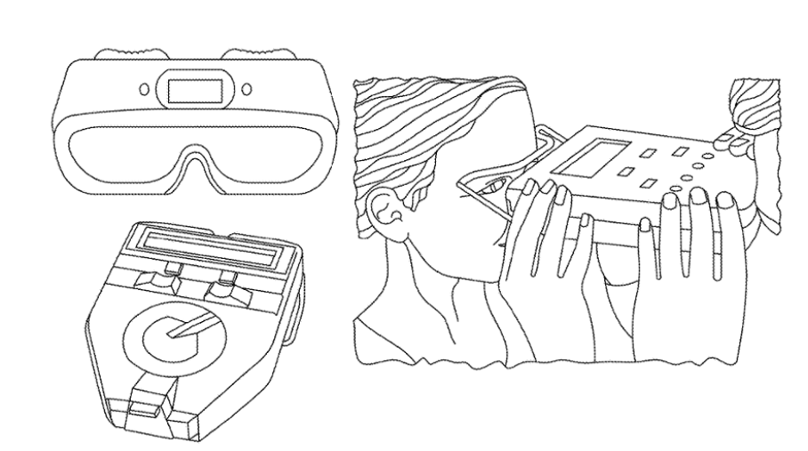

# 🚀 [Grupo 3]

## 👥 Foto grupal

## 👥 Integrantes

| Nombre | Función |
|--------|---------|
| Anyelo Armando Castillo Mayta | Programador |
| Alexandra Milagros Mamani Casas | Electrónica |
| Ariana Fabiana del Valle Fuentes Contreras | Diseño de aplicación |
| Katherin Araceli  Berrio Ordoñez | Electrónica |
| Ricardo Sebastián Murillo Sedano| Diseño de producto y manufactura |

## 👩‍💻 Problemática
El traumatismo craneoencefálico (TCE), incluidas las conmociones y contusiones cerebrales, representa un importante problema de salud pública. Se estima que ocurren aproximadamente 69 millones de casos de TCE al año en el mundo, asociados con cerca de 1,5 millones de muertes. Esta patología se manifiesta frecuentemente en contextos de accidentes de tránsito, desastres y conflictos sociales, siendo los traumatismos leves diez veces más frecuentes que los graves [3][4].

En accidentes, terremotos y otros escenarios de emergencia, la identificación inicial del daño cerebral suele depender de la observación clínica, la respuesta a una linterna y escalas conductuales. Sin embargo, estas evaluaciones son subjetivas y pueden pasar por alto alteraciones pupilares sutiles. Se ha reportado una discordancia del 18 % entre la evaluación manual y la pupilometría automatizada, además de un 39 % de error en pupilas menores de 2 mm. Asimismo, el personal sanitario no identificó la mitad de los casos de anisocoria detectados mediante un pupilómetro [1]. Por ello, se estima que la detección visual prehospitalaria de una conmoción cerebral puede presentar un margen de error de entre 20 % y 60 %, equivalente a una sensibilidad aproximada del 40–80 %, dependiendo de la prueba utilizada. 

Esta problemática es especialmente relevante en pacientes sintomáticos, en quienes la evaluación tradicional no permite cuantificar variaciones pupilares de pocos milisegundos, y en pacientes asintomáticos, inconscientes o no comunicativos, frecuentes en rescates y desastres. Por tanto, existe la necesidad de desarrollar un pupilómetro portátil con inteligencia artificial capaz de medir objetivamente la dinámica pupilar y generar alertas de apoyo al triaje prehospitalario.[2]

Referencias

*[1] D. Couret et al., "Reliability of standard pupillometry practice in neurocritical care: An observational, double-blinded study," Critical Care, 2016.*

*[2] C.-H. Hsu and L.-T. Kuo, "Application of Pupillometry in Neurocritical Patients," Journal of Personalized Medicine, vol. 13, no. 7, Art. no. 1100, 2023, doi: 10.3390/jpm13071100.*

*[3] M. D. Tello Vélez and J. R. Serrano Terreros, Revisión sistemática sobre factores asociados a mal pronóstico en pacientes con trauma craneoencefálico ingresados por el Departamento de Emergencia en América Latina, tesis de titulación, Universidad del Azuay, Cuenca, Ecuador, 2023.*

*[4] B. A. Kotsias, "Traumatismo craneoencefálico," Medicina (Buenos Aires), 2018.*

## 🔍 Estado del arte

### 1.1 Tecnología existente en el ámbito comercial

#### 1.1.1 Pupilómetros infrarrojos clínicos y de investigación

#### Hitomiru-003

Equipo portátil de Uratani Shoji diseñado para medir simultáneamente las pupilas derecha e izquierda. Utiliza iluminación cercana al infrarrojo de 860 nm para observar la pupila y una fuente de luz blanca independiente como estímulo. El sistema registra video y permite obtener el diámetro máximo, el diámetro mínimo y el diámetro de la pupila en cada cuadro. Su software muestra la imagen captada, el borde detectado de la pupila, los valores en milímetros y una gráfica temporal.

| Característica | Descripción |
| --- | --- |
| Iluminación | Infrarrojo cercano de 860 nm |
| Estímulo | Luz blanca |
| Captura | 640 × 480 píxeles, 20 fps |
| Alimentación | 6 V mediante 4 baterías AA |
| Dimensiones | 6,5 × 4,8 × 2,7 in (aprox. 165 × 122 × 69 mm) |
| Peso | 477 g, sin baterías |
| Salida | Video, diámetro máximo/mínimo y diámetro por cuadro |

Figura 1.

#### NeurOptics NPi-300

Pupilómetro óptico portátil orientado a evaluaciones neurológicas. Integra tecnología infrarroja, óptica de precisión, procesamiento interno y pantalla para mostrar el tamaño pupilar y el Neurological Pupil index (NPi). A diferencia de una solución dependiente de computadora, el resultado se presenta directamente en el dispositivo y puede compararse entre ambos ojos. Las instrucciones de uso especifican que los resultados se emplean como información para la evaluación pupilar y no deben utilizarse de manera aislada para realizar un diagnóstico clínico. [2]

| Característica | Descripción |
| --- | --- |
| Rango de diámetro | 0,80 a 10,00 mm |
| Exactitud de tamaño | ±0,03 mm |
| Cambio detectable | 0,03 mm (30 µm) |
| Alimentación | Batería Li-ion 3,6 V, 11,70 Wh, 3350 mAh |
| Carga | Carga inalámbrica Qi de 5 W |
| Dimensiones | 7,5 × 3,5 × 3,5 in sin SmartGuard |
| Peso | 344 ± 10 g |
| Salida | Diámetro, NPi, diferencia entre ojos y tendencias |

Figura 2.

### 1.2 Tecnología en desarrollo y prototipos

#### LIOR™

LIOR es un pupilómetro digital de bolsillo en desarrollo orientado a entornos de emergencia y cuidados críticos. Su propuesta prioriza una interfaz simple: una cámara infrarroja captura la pupila, el procesamiento se realiza internamente y el operador recibe el tamaño mediante una escala de LEDs de 1 a 9 mm y la reactividad mediante indicadores verde, amarillo y rojo. La documentación del desarrollador describe una cámara IR rodeada por 10 LEDs, microcontrolador, PCB y puerto USB-C. El dispositivo mide aproximadamente 170 mm de longitud. Es importante diferenciar el estado tecnológico: el fabricante indica que el producto se encuentra en ruta de validación. El valor de 95 % de exactitud publicado corresponde a simulaciones Monte Carlo con condiciones generadas y no debe interpretarse como una validación clínica definitiva.

| Característica | Descripción |
| --- | --- |
| Estado | En desarrollo / preparación para validación |
| Longitud | Aproximadamente 170 mm |
| Captura | Cámara infrarroja |
| Iluminación | Anillo de 10 LEDs alrededor de la cámara |
| Interfaz | LEDs de tamaño 1-9 mm + reactividad verde/amarillo/rojo |
| Control | Un botón; modo de pupilómetro y modo linterna |
| Alimentación | Recargable por USB-C |
| Datos | Enfoque de punto de atención; sin necesidad de mostrar imagen |

Figura 3.

#### Pupilmate

Pupilmate es un prototipo académico de pupilómetro binocular, portátil y de bajo costo. Fue publicado como un sistema de construcción propia para registrar de manera objetiva los reflejos pupilares directo y consensual. Utiliza dos cámaras ESP32 con Wi-Fi, dos arreglos de LEDs infrarrojos alrededor de las cámaras y dos LEDs blancos controlados por interruptores para estimular cada ojo. La carcasa bloquea la luz ambiental y permite obtener simultáneamente video de ambas pupilas. El artículo se centra en el registro y observación repetible del reflejo mediante video; no presenta al Pupilmate como un equipo comercial validado ni como un sistema que calcule automáticamente el diámetro pupilar en milímetros. Por ello, su principal aporte para este proyecto está en la arquitectura económica de captura infrarroja, que podría complementarse con procesamiento de imagen automático.

| Característica | Descripción |
| --- | --- |
| Cámaras | 2 × ESP32-CAM con Wi-Fi |
| Iluminación IR | 2 × arreglos de 36 LEDs infrarrojos |
| Estímulo | 2 × LEDs blancos independientes |
| Carcasa | Aprox. 10,5 × 7,8 × 13 cm |
| Alimentación | Fuente externa de 12 V / 5 A |
| Salida | Video simultáneo de ambas pupilas por Wi-Fi |
| Costo reportado | Rs. 2399 para los materiales descritos |
| Uso descrito | Tamizaje y documentación del reflejo directo/consensual |

Figura 4.

#### Low-Cost Portable Pupilometer for Circadian Rhythm Studies

Es un pupilómetro portátil de bajo costo basado en Raspberry Pi, desarrollado para registrar cuantitativamente la respuesta pupilar a estímulos luminosos. El dispositivo utiliza una Raspberry Pi 3 como unidad de adquisición y control, junto con una Raspberry Pi NoIR Camera V2, equipada con un sensor CMOS Sony IMX219PQ. Al no incorporar un filtro de bloqueo infrarrojo, la cámara puede trabajar tanto en el espectro visible como en el infrarrojo cercano, lo que la hace apropiada para el registro de la pupila. La cámara es controlada mediante Python utilizando la API PiCamera. El sistema incorpora además un circuito temporizador electrónico externo encargado de controlar el momento y duración del estímulo luminoso. De esta manera, la grabación comienza antes de aplicar el estímulo y continúa durante la contracción y recuperación de la pupila, permitiendo registrar la dinámica completa del reflejo pupilar. El preprocesamiento de las imágenes se realiza en la Raspberry Pi mediante Python, mientras que el estudio original utilizó MATLAB e ImageJ para el análisis posterior. El prototipo fue evaluado utilizando estímulos luminosos de 635 nm para luz roja y 463 nm para luz azul. Los autores probaron el dispositivo en ambos ojos de una participante durante un periodo de 20 días, demostrando que el sistema era capaz de registrar variaciones de la respuesta pupilar asociadas a diferentes longitudes de onda y momentos del día. El dispositivo fue desarrollado por Ingrid Ameyalli Hernández-Barrios y Edgar Guevara y publicado en 2024 en la Revista Mexicana de Ingeniería Biomédica.

| Característica | Descripción |
| --- | --- |
| Tipo de dispositivo | Pupilómetro portátil de bajo costo |
| Unidad de procesamiento | Raspberry Pi 3 |
| Cámara | Raspberry Pi NoIR Camera V2 |
| Sensor de imagen | Sony IMX219PQ CMOS |
| Espectro de cámara | Visible 400–700 nm y NIR 800–2500 nm reportado por los autores |
| Estímulo rojo | 635 nm |
| Estímulo azul | 463 nm |
| Control de cámara | Python + PiCamera API |
| Control del estímulo | Circuito temporizador electrónico externo |
| Preprocesamiento | Python en Raspberry Pi |
| Análisis utilizado en el estudio | MATLAB R2017b + ImageJ 1.52p |
| Salida principal | Video/imágenes de la respuesta pupilar y análisis temporal |
| Aplicación propuesta | Investigación neurológica y estudio de respuesta pupilar/ritmos circadianos |

#### Componentes identificados

| Componente | Cantidad / modelo |
| --- | --- |
| Raspberry Pi | 1 × Raspberry Pi 3 |
| Cámara | 1 × Raspberry Pi NoIR Camera V2 |
| Sensor | Sony IMX219PQ |
| Circuito temporizador | 1 × circuito electrónico externo |
| Fuente de estímulo rojo | 635 nm |
| Fuente de estímulo azul | 463 nm |
| Software de adquisición | Python + PiCamera |
| Software de análisis | MATLAB + ImageJ |

#### Development of a Smartphone-based Pupillometer

Este trabajo presenta un prototipo de pupilómetro portátil basado en un teléfono inteligente, desarrollado para reducir el tamaño y costo de los sistemas de pupilometría convencionales. El dispositivo utiliza la cámara integrada del smartphone para adquirir imágenes del ojo y combina iluminación infrarroja con un estímulo luminoso visible para observar los cambios producidos por el reflejo pupilar. El prototipo fue desarrollado utilizando un smartphone KM-S120 de KT Tech equipado con una cámara principal de 3 megapíxeles. El módulo óptico incorpora cuatro LEDs infrarrojos con una longitud de onda máxima de 850 nm, empleados para iluminar el ojo durante condiciones de oscuridad sin generar el estímulo visible utilizado para producir la contracción pupilar. Adicionalmente, dispone de un LED visible, reportado con una longitud de onda máxima de 570 nm, utilizado para provocar la miosis. Delante de la cámara se instala un filtro IR720 Horusbennu, destinado a favorecer la adquisición de la radiación infrarroja reflejada por el ojo y reducir la interferencia producida por la fuente de estimulación visible. El control de las fuentes luminosas se realiza mediante una placa Arduino Uno basada en el microcontrolador ATmega328. La carcasa del módulo óptico tiene aproximadamente 6 cm de longitud y 4 cm de diámetro y se coloca alrededor de la región ocular para reducir la influencia de la iluminación ambiental. Durante el estudio, la fuente visible se encontraba aproximadamente a 2 cm del ojo. Las imágenes adquiridas son procesadas mediante etapas de mejora de contraste, reducción de ruido, segmentación y procesamiento morfológico para identificar la región correspondiente a la pupila. A diferencia de otros pupilómetros que se concentran únicamente en el diámetro, este prototipo calcula principalmente la relación de constricción del área pupilar. En la evaluación realizada sobre imágenes del prototipo, los autores reportaron una precisión media de 97.7 ± 1.3 % para el algoritmo de localización/segmentación pupilar; este valor no debe interpretarse como una precisión diagnóstica clínica. El estudio involucró 16 participantes sanos.

#### Características

| Característica | Descripción |
| --- | --- |
| Tipo de dispositivo | Pupilómetro portátil basado en smartphone |
| Smartphone utilizado | KT Tech KM-S120 |
| Cámara | Cámara principal de 3 MP |
| Iluminación IR | 4 × LEDs infrarrojos |
| Longitud de onda IR | 850 nm |
| Estímulo visible | 1 × LED visible |
| Longitud de onda reportada del estímulo | 570 nm |
| Control | Arduino Uno |
| Microcontrolador | ATmega328 |
| Filtro óptico | IR720 Horusbennu |
| Dimensiones del módulo | 6 cm de longitud × 4 cm de diámetro |
| Procesamiento | Mejora de contraste → reducción de ruido → segmentación → procesamiento morfológico |
| Variable analizada | Relación de constricción del área pupilar |
| Precisión reportada del algoritmo | 97.7 ± 1.3 % para localización/segmentación pupilar |
| Aplicación propuesta | Pupilometría portátil, investigación y atención en lugares con recursos limitados |

Figura 5.

#### Componentes identificados

| Componente | Cantidad / modelo |
| --- | --- |
| Smartphone | 1 × KT Tech KM-S120 |
| Cámara | 1 × cámara integrada de 3 MP |
| LED infrarrojo | 4 × 850 nm |
| LED de estímulo | 1 × 570 nm |
| Filtro óptico | 1 × IR720 Horusbennu |
| Microcontrolador | 1 × Arduino Uno / ATmega328 |
| Carcasa óptica | 1 × cuerpo de 6 × 4 cm |
| Conexión/alimentación del controlador | USB |
| Procesamiento experimental | MATLAB |
| Aplicación móvil | Android, desarrollada como parte del proyecto |

### 1.3 Tecnología existente en el ámbito de patentes

#### WO2020132754A1 A binocular campimetric pupillometer devide for neuropharmacological and functional brain assessment

Es un dispositivo pupilómetro campímetro de carácter binocular para la evaluación objetiva de alteraciones neurológicas y neurofarmacológicas en la vía visual. El sistema se encuentra integrado en una máscara colocada sobre ambos ojos que reduce considerablemente la entrada de luz ambiental. Para cada ojo dispone de una unidad de estimulación y una unidad de medición independientes, permitiendo controlar los estímulos luminosos y registrar simultáneamente la respuesta pupilar de ambos ojos. Cada unidad de estimulación está formada por múltiples fuentes luminosas, preferentemente LEDs distribuidos en forma de anillo alrededor del perímetro ocular. Estos LEDs pueden generar estímulos visibles a diferentes longitudes de onda, principalmente rojo, verde y azul, además de emitir radiación infrarroja invisible para el paciente. La iluminación infrarroja es utilizada por las cámaras para mantener enfocadas las pupilas y medir continuamente su diámetro sin generar un estímulo visible adicional. El dispositivo posee una cámara independiente para cada ojo, permitiendo adquirir imágenes sincronizadas y determinar el diámetro de ambas pupilas en tiempo real. Una de las configuraciones descritas establece el uso de cámaras digitales de al menos 200 cuadros por segundo, permitiendo registrar los cambios rápidos asociados con el reflejo pupilar. El sistema almacena las imágenes y las mediciones del diámetro en función del tiempo, pudiendo transferir los resultados a un teléfono móvil, tablet o computadora para su visualización y procesamiento. La estimulación de cada ojo puede controlarse independientemente en intensidad, longitud de onda y posición angular. Esto permite analizar tanto el reflejo pupilar directo como el consensual, estimulando un ojo mientras se registra simultáneamente la respuesta de ambos. A partir de las imágenes adquiridas, el sistema puede calcular parámetros como diámetro basal, contracción máxima, dilatación máxima, velocidad de contracción, velocidad de dilatación y diferencias entre ambos ojos.

#### Características

| Característica | Descripción |
| --- | --- |
| Tipo de dispositivo | Pupilómetro campimétrico binocular |
| Configuración | Máscara para ambos ojos |
| Iluminación de medición | Radiación infrarroja |
| Estímulo | LEDs de distintas longitudes de onda; principalmente rojo, verde y azul |
| Distribución de LEDs | Anillo alrededor de cada ojo |
| Captura | Una cámara digital independiente por ojo |
| Velocidad de captura | Al menos 200 fps en una de las configuraciones descritas |
| Medición | Diámetro pupilar de ambos ojos en tiempo real |
| Reflejos evaluados | Directo y consensual |
| Variables calculadas | Diámetro basal, contracción y dilatación máximas, velocidades y diferencias interoculares |
| Salida / Datos | Imágenes y curva diámetro pupilar vs. tiempo |
| Dispositivo externo | Puede conectarse a móvil, tablet o computadora |
| Elemento distintivo | Estimulación multiespectral y espacialmente selectiva de diferentes regiones del campo visual |

#### CN121795829A Pupilometro infrarojo portatil con funcion de apertura de parpados y metodo de medicion de pupilas

Su innovación central es un mecanismo mecánico que resuelve un problema típico de los pupilómetros actuales: la necesidad de usar ambas manos (una para separar el párpado y otra para sostener el equipo). Al presionar el gatillo, un sistema de cremallera-piñón (齿轮齿条) mueve dos correderas (una vertical y otra horizontal) conectadas por bielas superior e inferior a los "contactores" de párpado superior e inferior; estos se desplazan en direcciones opuestas abriendo el ojo de forma controlada y no invasiva (sin pinzas ni ganchos). Un mecanismo de bloqueo (varilla de enganche + ranura unidireccional + resorte) permite que un solo apretón del gatillo mantenga el párpado abierto, y un segundo apretón lo libere, todo operable con una sola mano. En cuanto a la teoría de medición, el equipo integra un microcontrolador, una cámara, LEDs infrarrojos (para iluminar sin alterar la respuesta pupilar) y una fuente de estímulo lumínico multicolor (blanco/rojo/verde/azul) para inducir y registrar la contracción pupilar. El algoritmo de procesamiento aplica un filtro gaussiano de preprocesamiento, detección de círculos por transformada de Hough (para pupila e iris), fusión ponderada de los centros de ambos círculos (dado que son aproximadamente concéntricos), y un filtro recursivo de suavizado temporal para estabilizar la medición entre cuadros. Para convertir tamaños en píxeles a milímetros reales, coloca un par de puntos fluorescentes de distancia física fija en los contactores palpebrales, que sirven como referencia de escala (Q = D/d). Con esto se calcula no solo el diámetro absoluto de pupila e iris, sino también un índice novedoso: la relación de área pupila-iris, propuesto como parámetro normalizado independiente del dispositivo para comparaciones clínicas.

#### Características

| Característica | Descripción |
| --- | --- |
| Iluminación | Pupilómetro portátil autónomo |
| Estímulo | LEDs infrarrojos, longitud de onda ~850 nm (4 unidades), para contraste pupila-iris |
| Alimentación | Batería ( polímero de litio), sin cifras de voltaje/mAh especificadas |
| Carga | Carga por cable Type-C y carga inalámbrica (módulo dedicado) |
| Salida / Datos | Diámetro real de pupila e iris, relación de área pupila-iris, transmisión inalámbrica (WiFi) a sistema PC, pantalla LCD integrada |
| Interfaz | Gatillo único: 1er disparo = apertura palpebral + inicio de captura; 2º disparo = cierre |
| Mecanismo distintivo | Apertura palpebral mecánica no invasiva integrada (cremallera-piñón + correderas) — ausente en las tres referencias de las imágenes |
| Algoritmo | Filtro gaussiano → detección de círculos (Hough) → fusión ponderada de centros → filtro recursivo de suavizado → conversión píxel→mm vía puntos fluorescentes de referencia |

Figura 6.

#### US6022109A Hand-held Pupilometer

El equipo es un pupilómetro portátil de mano diseñado para medir la respuesta pupilar ante un estímulo luminoso sin necesidad de estar conectado permanentemente a una computadora externa. El dispositivo integra en una carcasa compacta los componentes ópticos, electrónicos y de procesamiento necesarios para realizar la evaluación. Su sistema utiliza una fuente de luz visible para provocar la contracción de la pupila y una fuente de radiación infrarroja para iluminar el ojo durante la medición. La radiación infrarroja reflejada por el ojo es captada mediante un detector óptico, que puede corresponder a una cámara CCD, un arreglo de fotodetectores u otro sensor capaz de generar una señal relacionada con el diámetro pupilar. El equipo incorpora además un microprocesador interno encargado de controlar la secuencia de iluminación, recibir y procesar la señal procedente del sensor y calcular parámetros de la respuesta pupilar como el diámetro inicial, mínimo y final de la pupila, velocidad de constricción, tiempo hasta alcanzar el diámetro mínimo y amplitud del reflejo pupilar. Los datos obtenidos pueden almacenarse directamente en el dispositivo y visualizarse mediante una pantalla integrada, eliminando la necesidad de utilizar una computadora durante la medición. El pupilómetro presenta una estructura similar a unos binoculares con dos apoyos oculares, aunque utiliza un solo sistema óptico de medición. Para evaluar ambos ojos, primero se realiza la medición de uno de ellos y posteriormente se invierte el dispositivo para analizar el ojo contrario. Esta configuración permite reducir el número de componentes ópticos, así como el tamaño, complejidad y costo del equipo.

#### Características

| Característica | Descripción |
| --- | --- |
| Tipo de dispositivo | Pupilómetro portátil autónomo |
| Método de iluminación | 2 × arreglos de 36 LEDs infrarrojos |
| Estímulo | 2 × LEDs blancos independientes |
| Carcasa | Aprox. 10,5 × 7,8 × 13 cm |
| Alimentación | Fuente externa de 12 V / 5 A |
| Salida | Video simultáneo de ambas pupilas por Wi-Fi |
| Costo reportado | Rs. 2399 para los materiales descritos |
| Uso descrito | Tamizaje y documentación del reflejo directo/consensual |

#### US11684259B2 Pupillometer for lesion location determination

"Pupillometer for Lesion Location Determination", describe un pupilómetro electrónico tipo "linterna" (flashlight-like) cuyo objetivo no es solo medir el tamaño pupilar, sino determinar la ubicación de lesiones cerebrales analizando tanto el reflejo pupilar directo como el consensual. A diferencia de los pupilómetros comerciales actuales (como el NPi-200 de NeurOptics), que examinan cada ojo de forma independiente y solo miden la respuesta directa (contracción del ojo iluminado), este dispositivo añade una luz visible expandible/extensible que se proyecta desde el cuerpo principal hacia el ojo contralateral, permitiendo capturar simultáneamente la respuesta consensual (la contracción del ojo no iluminado directamente) mientras una cámara con filtro infrarrojo registra continuamente ambos ojos. Con estos dos tipos de datos —respuesta directa y consensual, izquierda y derecha— se generan hasta 4 mediciones (reflejo directo izquierdo, consensual izquierdo, directo derecho, consensual derecho), cuya combinación normal/anormal permite inferir en qué segmento neural específico de la vía pupilar se encuentra la lesión. El funcionamiento se basa en un subsistema de luz dual: luz infrarroja (iluminación continua, invisible, no interfiere con el reflejo pupilar y funciona en oscuridad total) para la adquisición de imagen/video, y luz visible (blanca) como estímulo que activa la contracción pupilar. El procesamiento sigue el flujo: filtro IR → adquisición de imagen → segmentación de la región pupilar mediante una red neuronal convolucional (entrenada con imágenes segmentadas manualmente, logrando 100% de precisión reportada en la determinación de forma/tamaño) → determinación de forma y tamaño de pupila → cuantificación de la respuesta pupilar → estimación de la ubicación de la lesión. La secuencia temporal de iluminación alterna encendido/apagado de luz visible en cada ojo mientras el IR permanece constante, permitiendo capturar las cuatro respuestas antes mencionadas en aproximadamente 1 segundo por medición.

#### Características

| Característica | Descripción |
| --- | --- |
| Tipo de dispositivo | Pupilómetro tipo "linterna" (flashlight-like), monocular por captura pero con estímulo binocular |
| Iluminación | Luz infrarroja continua (filtro IR que bloquea luz visible; no especifica longitud de onda exacta) |
| Estímulo | Luz visible: fuente 1 (fija, en la carcasa, para el ojo bajo examen) + fuente 2 (y opcionalmente 3) extensible/expandible fuera de la carcasa, para iluminar el ojo contralateral y captar respuesta consensual |
| Captura | Dispositivo de imagen/video (cámara) dentro de la carcasa |
| Salida / Datos | Tamaño y forma de pupila (vía red neuronal convolucional), cuantificación de respuesta pupilar directa y consensual (ambos ojos), estimación de ubicación de lesión neural (1 de 8 segmentos posibles) |
| Interfaz / Control | Sistema de control que manipula automáticamente fuente de luz visible, fuente IR y dispositivo de imagen según protocolo temporizado |
| Elemento distintivo | Brazo de luz visible extensible/rotable para estimular el ojo contralateral y medir reflejo consensual — resuelve la limitación de pupilómetros que solo miden reflejo directo por ojo |
| Algoritmo | Red neuronal convolucional para segmentación/tamaño de pupila; lógica de clasificación de 16 combinaciones posibles de respuesta normal/anormal → mapeo a segmentos neuronales lesionados |

Figura 7.

#### WO2020034951A1 Systems and methos for evaluating popillary response

La patente presenta un sistema para la evaluación automatizada de la respuesta pupilar a la luz, diseñado para implementarse en dispositivos electrónicos portátiles como teléfonos inteligentes o visores. El sistema integra una pantalla, una cámara, un procesador y memoria. La pantalla funciona como fuente de estímulo visible, mientras que la cámara registra imágenes o video del ojo durante la contracción y posterior dilatación de la pupila. Posteriormente, estas imágenes son procesadas para identificar características de la respuesta pupilar y obtener parámetros cuantitativos. Una de las configuraciones propuestas incorpora específicamente una cámara infrarroja y un emisor de radiación infrarroja entre 700 y 1000 nm. La iluminación infrarroja permite registrar la pupila después del estímulo visible sin producir un estímulo luminoso visible adicional que pueda modificar la respuesta que se intenta medir. El sistema también puede utilizar información de un sensor de luz ambiental para determinar si las condiciones de iluminación son apropiadas para realizar el examen. Para determinar el tamaño pupilar, las imágenes pueden convertirse a escala de grises y segmentarse para separar las regiones correspondientes a pupila, iris y esclerótica. La patente propone diferentes métodos de procesamiento, entre ellos umbralización, agrupamiento K-means, detección de bordes y análisis de circularidad; además, contempla técnicas de aprendizaje automático y redes de segmentación como U-Net. Una vez identificada la pupila, su dimensión en píxeles puede convertirse a una medida física en milímetros utilizando una referencia de escala conocida. El procesamiento permite obtener parámetros como diámetro pupilar mínimo y máximo, latencia, velocidad de constricción, velocidad de dilatación, amplitud y porcentaje de constricción y tiempo de recuperación. Estos valores pueden compararse con mediciones basales o datos de referencia para evaluar desviaciones de la respuesta pupilar. La patente también propone la recopilación de mediciones longitudinales para establecer una línea basal individual y observar cambios asociados con enfermedad o trauma

#### Características

| Característica | Descripción |
| --- | --- |
| Tipo de sistema | Sistema portátil para evaluación automatizada del reflejo pupilar |
| Plataforma | Dispositivo móvil, smartphone o visor/headset |
| Estímulo | Luz visible generada mediante pantalla o fuente luminosa |
| Iluminación de medición | Radiación infrarroja |
| Longitud de onda IR | 700–1000 nm |
| Captura | Cámara infrarroja o cámara de luz visible según configuración |
| Sensor adicional | Sensor de iluminación ambiental |
| Procesamiento | Segmentación pupila-iris, análisis de forma y técnicas de aprendizaje automático |
| Conversión de medida | Píxeles → mm mediante referencia conocida o escala de cámara |
| Salida / Datos | Diámetros, latencia, velocidades de constricción/dilatación, amplitud, porcentaje de constricción, recuperación, entre otros |
| Elemento distintivo | Integración de estímulo, captura y procesamiento en un dispositivo electrónico portátil |

### 1.4 Factores comunes en el estado del arte

| Factor común | Presencia en el estado del arte | Descripción / tendencia identificada |
| --- | --- | --- |
| Uso de tecnología infrarroja | Muy alta | La mayoría de los dispositivos utilizan iluminación o captura infrarroja para observar la pupila sin introducir un estímulo visible adicional que modifique su respuesta. Se encuentran valores específicos como 860 nm, aproximadamente 850 nm y rangos de 700–1000 nm. |
| Captura óptica de la pupila | Muy alta | Se emplean cámaras infrarrojas, cámaras digitales, CCD u otros detectores ópticos para registrar imágenes o video del ojo y determinar sus características pupilares. |
| Estímulo luminoso visible controlado | Alta | La mayoría de los sistemas incorporan una fuente visible independiente para provocar el reflejo pupilar. Se utilizan LEDs blancos y estímulos de diferentes longitudes de onda, como rojo, azul, verde y amarillo-verde. |
| Medición del diámetro pupilar | Muy alta | El diámetro de la pupila constituye la variable principal de medición. Algunos sistemas determinan diámetro basal, mínimo, máximo o variación del diámetro en función del tiempo. |
| Procesamiento digital de la señal o imagen | Alta | Los sistemas más recientes procesan automáticamente las imágenes capturadas. Se emplean técnicas como segmentación, detección de bordes, transformada de Hough, filtros digitales, redes neuronales convolucionales y U-Net. |
| Conversión de imagen a una medida cuantitativa | Alta | Los sistemas transforman información obtenida en imágenes o píxeles en valores asociados al tamaño pupilar, generalmente expresados en milímetros. Algunos incorporan referencias físicas de escala para mejorar la medición. |
| Análisis dinámico del reflejo pupilar | Alta | Además del diámetro, diferentes tecnologías analizan parámetros temporales como velocidad de constricción, velocidad de dilatación, latencia, porcentaje de contracción, amplitud y tiempo de recuperación. |
| Procesamiento automatizado | Alta | Existe una tendencia a reducir la dependencia de la apreciación subjetiva del examinador mediante algoritmos que detectan automáticamente la pupila y calculan parámetros de respuesta. |
| Portabilidad | Muy alta | La mayoría de los antecedentes estudiados buscan reducir el tamaño del sistema mediante diseños portátiles, de mano, de bolsillo, tipo linterna, máscara o incluso utilizando smartphones y visores. |
| Procesamiento integrado o menor dependencia de una computadora | Alta | Los diseños más recientes incorporan microcontroladores, procesadores internos o procesamiento mediante dispositivos móviles, reduciendo la necesidad de utilizar una computadora externa durante el examen. |
| Presentación directa de resultados | Alta | Los resultados pueden mostrarse mediante pantallas LCD, LEDs indicadores, software, dispositivos móviles o gráficas de diámetro pupilar respecto al tiempo. |
| Evaluación de ambos ojos | Media-Alta | Varias tecnologías permiten analizar ambos ojos de manera simultánea o secuencial. Algunos sistemas permiten además comparar las diferencias entre la pupila derecha e izquierda. |
| Evaluación del reflejo directo y consensual | Media | Algunos dispositivos y patentes más avanzados registran no solo la respuesta del ojo estimulado directamente, sino también la respuesta del ojo contralateral, permitiendo obtener información adicional de la vía neurológica. |
| Control de la luz ambiental | Media-Alta | Se utilizan máscaras, apoyos oculares y carcasas cerradas para disminuir la iluminación externa. Algunos diseños incorporan además filtros ópticos o sensores de iluminación ambiental. |
| Automatización del protocolo de iluminación | Media-Alta | En varias patentes, el sistema controla automáticamente la iluminación infrarroja, el estímulo visible y el momento de adquisición de las imágenes siguiendo una secuencia previamente definida. |
| Orientación hacia evaluación neurológica | Alta | Una parte importante de los dispositivos utiliza la respuesta pupilar como información cuantitativa para apoyar evaluaciones neurológicas. Algunas patentes incluso proponen analizar reflejos directos y consensuadas para inferir alteraciones de determinadas vías nerviosas. |

## 📃 Lista de exigencias
